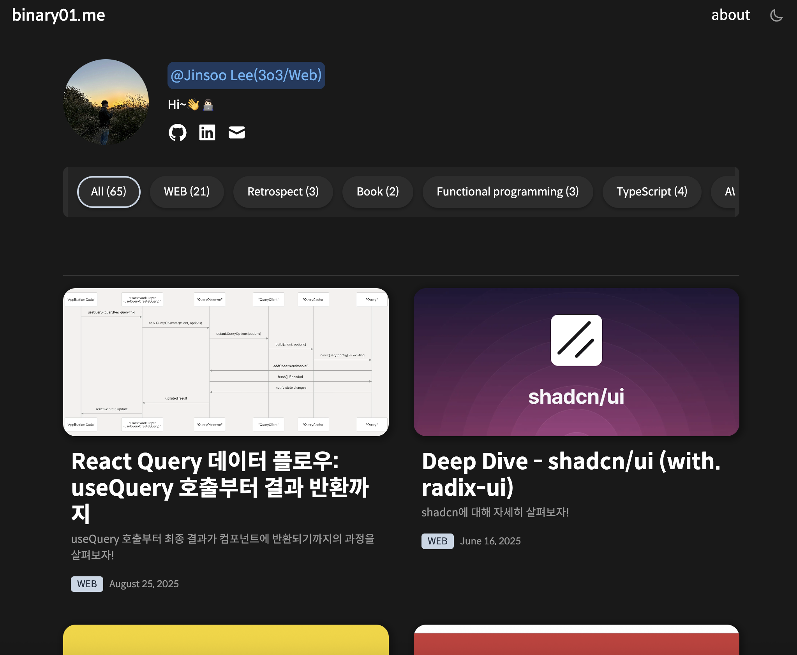

# binary01.me

Notion을 CMS로 활용하는 개인 블로그

[](https://nextjs.org/)
[](https://react.dev/)
[](https://www.typescriptlang.org/)
[](https://tailwindcss.com/)

<p align="center">
  
  
</p>

🔗 **Demo**: [binary01.me](https://binary01.me)

## ✨ 주요 기능

- **Notion CMS** - Notion 데이터베이스로 포스트 관리, 재배포 없이 콘텐츠 업데이트
- **무한 스크롤** - 카테고리 필터링과 함께 동작하는 무한 스크롤
- **이미지 최적화** - Plaiceholder로 blur placeholder 자동 생성
- **다크 모드** - 시스템 설정 연동 + 수동 전환 지원
- **댓글** - Giscus 기반 GitHub Discussions 댓글

## 🛠 기술 스택

| 분류 | 기술 |
|------|------|
| Framework | Next.js 16 (App Router) |
| Language | TypeScript 5.8 |
| Styling | Tailwind CSS 4 |
| State | Jotai |
| CMS | Notion API |
| Optimization | React Compiler, Plaiceholder |
| Comment | Giscus |

## 🚀 시작하기

```bash
# 의존성 설치
pnpm install

# 환경 변수 설정
cp .env.example .env.local
```

`.env.local` 설정:

```bash
NOTION_TOKEN=your_notion_token
NOTION_POST_DATABASE_ID=your_database_id
NOTION_ABOUT_ID=your_about_page_id
NOTION_PROFILE_ID=your_profile_image_id
BLOG_URL=https://your-domain.com
```

```bash
# 개발 서버 실행
pnpm dev
```

## 📝 License

MIT © [Jinsoo Lee](https://binary01.me)
