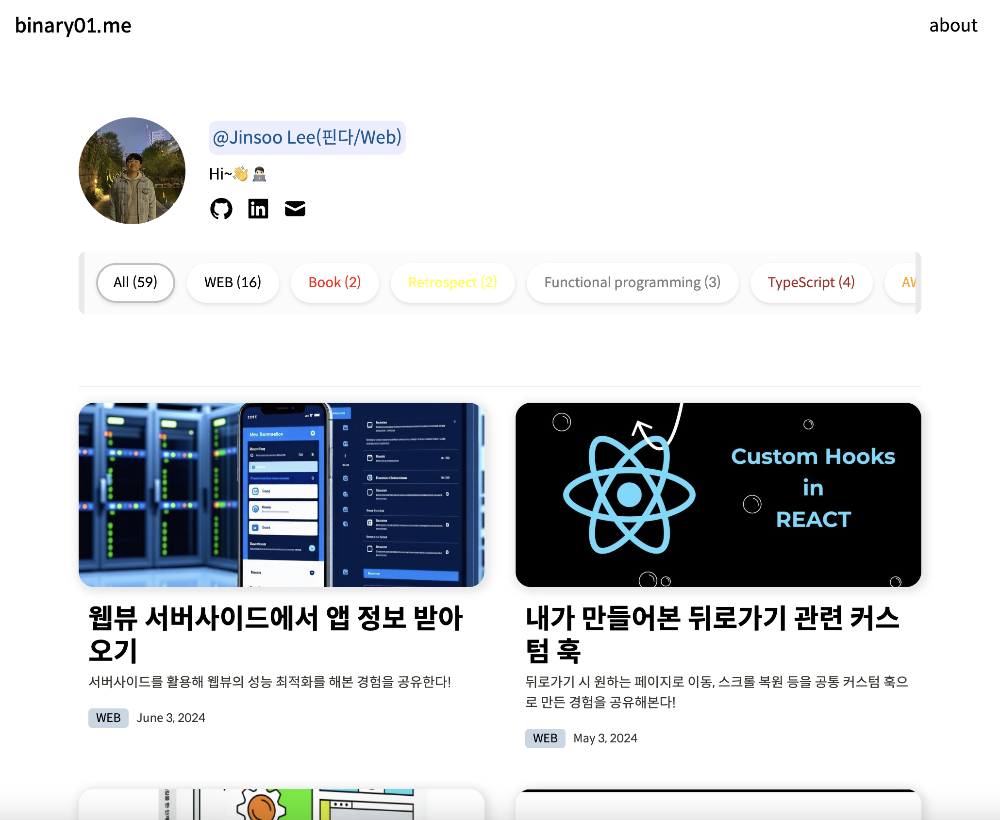

# NextJS Blog with Notion, Tailwindcss



## Intro

Welcome to my personal blog built with NextJS, Notion API, and Tailwind CSS!

## Demo

- [My site](https://binary01.me)

## Features

- Built with Next.js, TypeScript, Tailwind CSS, and Jotai
- Supports responsive design
- Quickly configurable with the `site.config.ts` file
- Supports infinite scrolling
- Fetches posts from Notion DB using Notion API
- Allows post updates without redeployment using Next.js Revalidate when Notion DB changes
- Image thumbnail previews using the `lqip-modern` library
- Commenting feature with Giscus

## Installation

1. Clone the repository:

   ```bash
   git clone https://github.com/yourusername/your-repo-name.git
   ```

2. Navigate to the project directory:

   ```bash
   cd your-repo-name
   ```

3. Install the dependencies:

   ```bash
   yarn
   ```

4. Set up the environment variables. Create a .env.local file and add your Notion API key and database ID:

   ```bash
   NOTION_TOKEN=your_notion_token
   NOTION_POST_DATABASE_ID=your_notion_post_id
   NOTION_ABOUT_ID=about_your_notion_about_id
   BLOG_URL=your_blog_addr // ex: https://binary01.me
   ```

5. Run the development server:

   ```bash
   yarn dev
   ```

6. Open your browser and visit http://localhost:3000 to see the blog in action.

## License

MIT © [Lee Jinsoo](https://binary01.me)
